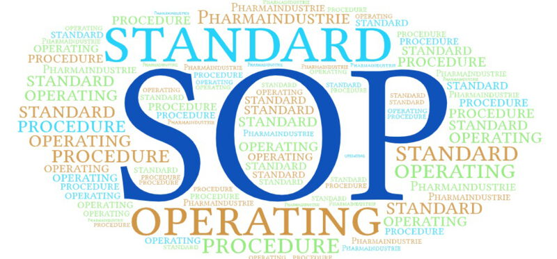

<h1 id="readme-top">SOP-Sampling</h1>

[![Contributors][contributors-shield]][contributors-url]
[![Forks][forks-shield]][forks-url]
[![Stargazers][stars-shield]][stars-url]
[![Issues][issues-shield]][issues-url]
[![project_license][license-shield]][license-url]
[![LinkedIn][linkedin-shield]][linkedin-url]


<!-- PROJECT LOGO -->
<br />
<div align="center">
  <a href="https://github.com/sandro-roth/SOP-Sampling">
    
  </a>

<h3 align="center">SOP sampling USZ Webinterface and Database</h3>

  <p align="center">
    This project aims to create a high-quality, human-validated dataset of SOP-related questions and answers.
    At the current stage, the focus is on annotating quotations and answers generated by experimental models through a dedicated UI.
    <br />
    <br />
    <a href="https://github.com/sandro-roth/SOP-Sampling/tree/main/docs"><strong>Explore the docs »</strong></a>
    <br />
    <br />
    <a href="https://github.com/sandro-roth/SOP-Sampling/issues/new?labels=bug&template=bug-report---.md">Report Bug</a>
    &middot;
    <a href="https://github.com/sandro-roth/SOP-Sampling/issues/new?labels=enhancement&template=feature-request---.md">Request Feature</a>
  </p>
</div>

---

<!-- TABLE OF CONTENTS -->
<details>
  <summary>Table of Contents</summary>
  <ol>
    <li><a href="#project-overview">Project Overview</a></li>
    <li><a href="#system-architecture">System Architecture</a></li>
    <li><a href="#runtime-environment">Runtime Environment</a></li>
    <li><a href="#configuration-env-file">Configuration (.env file)</a></li>
    <li><a href="#data-flow--persistence">Data Flow & Persistence</a></li>
    <li><a href="#database--api">Database & API</a></li>
    <li><a href="#resetting-the-project-state">Resetting the Project State</a></li>
    <li><a href="#roadmap">Roadmap</a></li>
    <li><a href="#contributing">Contributing</a></li>
    <li><a href="#license">License</a></li>
    <li><a href="#contact">Contact</a></li>
  </ol>
</details>

---

## Project Overview

This project focuses on building a **structured SOP annotation platform** through a web-based user interface.

Core objectives include:

- Annotation of SOP-related questions and answers  
- Validation of automatically generated content  
- Traceable linking of quotations to SOP documents  
- Creation of reproducible datasets for downstream evaluation and research  

The application is primarily intended for **clinical and research-oriented usage** within the USZ network.

<p align="right">(<a href="#readme-top">back to top</a>)</p>

---

## System Architecture

The application follows a modular, containerized architecture.

**Core components**

- Web UI for data entry and annotation  
- Backend service handling business logic  
- SQLite database for persistent storage  
- Internal API endpoints for debugging and data inspection  

**Technology stack**

- Python  
- Flask  
- SQLite  
- Docker & Docker Compose  

<p align="right">(<a href="#readme-top">back to top</a>)</p>

---

## Runtime Environment

This project is **not intended to be installed manually on arbitrary systems**.

- The code runs on a predefined server environment  
- Docker and Docker Compose are assumed to be available  
- All services are started via `docker compose`  
- No interactive installation steps are required  

The README focuses on **configuration, data handling, and operation**, not on local setup.

<p align="right">(<a href="#readme-top">back to top</a>)</p>

---

## Configuration (.env file)

The project is configured almost entirely via a `.env` file.

This file defines, among other things:

- Proxy settings  
- Docker container configuration  
- Service ports  
- Application-specific runtime flags  
- Environment-specific behavior  

This design allows the project to be **portable to other environments** without changing the source code.

> The `.env` file is required for running the services and is not committed to the repository.

<p align="right">(<a href="#readme-top">back to top</a>)</p>

---

## Data Flow & Persistence

### Source of Questions

Initial questions are loaded from:
> sop_questions_0_5.json

This file serves as the **source of truth** for the initial question set.

### Database Storage

- Data is stored in an SQLite database  
- The database file is created automatically during `docker compose` startup  
- If the database already exists, it will be reused  
- No manual database initialization is required  

The database file is stored inside the `/data` directory.

## Database & API

### Database Preview Endpoint

An internal API endpoint is available for inspecting the database contents.

**Show all tables**
```bash
    curl "http://sv10155:8522/api/db-preview"
```
Optionally limit the number of rows per table (default: 100)
```bash
    curl "http://sv10155:8522/api/db-preview?limit=20"
```

<p align="right">(<a href="#readme-top">back to top</a>)</p>

---

## Resetting the Project State

To fully reset the application state:

1. Remove the data directory:
   ```bash
   rm -rf data/
   ```
2. Restore the original question file:
    ```bash
   cp sop_questions_0_5_backup.json sop_questions_0_5.json
   ```
3. Restart the services using Docker Compose.
    This will:
   - Recreate the SQLite database
   - Reload the initial question set
   - Remove all previously annotated data

## Roadmap

- [X] Web UI for SOP annotation
- [X] SQLite-based persistent storage
- [X] Internal database preview endpoint
- [ ] User and role management
- [ ] Extended validation workflows
- [ ] Dataset export functionality
- [ ] Integration of external SOP repositories

## 🤝 Beiträge (Contributing)

Contributions are welcome.

How to contribute:

1. Fork the repository  
2. Create a feature branch  
3. Commit your changes  
4. Open a pull request

You may also open issues for bugs or feature requests.

## License

This project is distributed under the project license.  
See the `LICENSE.txt` file for more information.

## Contact

Sandro Roth  
Email: sandro.roth@usz.ch  

Project link:  
https://github.com/sandro-roth/SOP-Sampling

<p align="right">(<a href="#readme-top">back to top</a>)</p>


<!-- MARKDOWN LINKS & IMAGES -->
<!-- https://www.markdownguide.org/basic-syntax/#reference-style-links -->

[contributors-shield]: https://img.shields.io/github/contributors/sandro-roth/SOP-Sampling.svg?style=for-the-badge
[contributors-url]: https://github.com/sandro-roth/SOP-Sampling/graphs/contributors
[forks-shield]: https://img.shields.io/github/forks/sandro-roth/SOP-Sampling.svg?style=for-the-badge
[forks-url]: https://github.com/sandro-roth/SOP-Sampling/network/members
[stars-shield]: https://img.shields.io/github/stars/sandro-roth/SOP-Sampling.svg?style=for-the-badge
[stars-url]: https://github.com/sandro-roth/SOP-Sampling/stargazers
[issues-shield]: https://img.shields.io/github/issues/sandro-roth/SOP-Sampling.svg?style=for-the-badge
[issues-url]: https://github.com/sandro-roth/SOP-Sampling/issues
[license-shield]: https://img.shields.io/github/license/sandro-roth/SOP-Sampling.svg?style=for-the-badge
[license-url]: https://github.com/sandro-roth/SOP-Sampling/blob/master/LICENSE.txt
[linkedin-shield]: https://img.shields.io/badge/-LinkedIn-black.svg?style=for-the-badge&logo=linkedin&colorB=555
[linkedin-url]: https://www.linkedin.com/in/sandro-roth-80035080